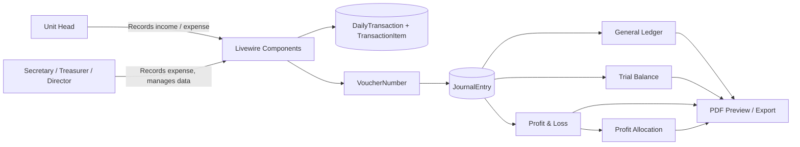

<div align="center">

# Teja Perceka

**A role-based financial management and accounting system for village-owned enterprises (BUMDes).**

<p>
  
  
  
  
  
  
  
  
</p>

</div>

---

Teja Perceka digitizes the daily bookkeeping of a BUMDes (*Badan Usaha Milik Desa*) that runs several tourism and service business units. Unit heads record daily income and expenses, and the system automatically produces double-entry journals, a general ledger, a trial balance, profit & loss statements, and profit allocation reports, all exportable as PDF.

---

## Table of Contents

- [Features](#features)
- [Tech Stack](#tech-stack)
- [Architecture Overview](#architecture-overview)
- [Roles and Permissions](#roles-and-permissions)
- [Getting Started](#getting-started)
  - [Prerequisites](#prerequisites)
  - [Installation](#installation)
  - [Configuration](#configuration)
  - [Running the Application](#running-the-application)
- [Default Seeded Accounts](#default-seeded-accounts)
- [Project Structure](#project-structure)
- [Domain Concepts](#domain-concepts)
- [Development](#development)
  - [Code Quality](#code-quality)
  - [Testing](#testing)

---

## Features

**Transaction recording**
- Daily (or weekly, per unit) income entry by unit heads, using configurable revenue categories.
- Four category pricing models: price × quantity, flat rate, free-form amount, and yearly contracts (e.g. kiosk rentals).
- Price management per category with price history and notifications when prices change.
- Expense recording for both unit heads and BUMDes management (director, secretary, treasurer).

**Accounting engine**
- Automatic double-entry journal generation for every recorded transaction.
- Voucher numbering with chronological insert-and-shift and automatic gap closing after deletions or month changes.
- Pre-seeded chart of accounts (assets, liabilities, equity, revenue, COGS, operating expenses, other income/expenses) with header accounts and ordering.

**Reporting**
- General Journal and Revenue history with recap views.
- General Ledger and Trial Balance.
- Profit & Loss statement.
- Profit Allocation report (monthly, semester, or yearly) with configurable allocation percentages, grouped as deductions and bylaw-based allocations.
- Inline PDF preview (printable in a new tab) and PDF export via DomPDF.

**Asset management**
- Asset register (name, quantity, unit, price, description) with role-based CRUD and read-only access for other roles.

**Administration and security**
- Seven-role access control built on Spatie Laravel Permission.
- Two-factor authentication (with recovery codes) and passkey login via Laravel Fortify.
- Email verification, login rate limiting, and password confirmation for sensitive settings.
- Super Admin user management, activity audit log, and audited user impersonation.
- Security headers (CSP, X-Frame-Options, nosniff, Referrer-Policy) applied globally.

**UX**
- Role-specific dashboards with Chart.js visualizations.
- Responsive layout (sidebar/header variants) built with Flux UI and Tailwind CSS v4.
- Dark/light appearance settings.

---

## Tech Stack

| Layer | Technology |
|-------|------------|
| Language / Runtime | PHP ^8.3 |
| Framework | Laravel 13 |
| UI framework | Livewire 4, Flux UI 2 (free) |
| Authentication | Laravel Fortify (email verification, 2FA, passkeys) |
| Authorization | Spatie Laravel Permission 8 |
| PDF generation | barryvdh/laravel-dompdf |
| Frontend tooling | Vite 8, Tailwind CSS 4 |
| Frontend libraries | Chart.js, Flatpickr, SweetAlert2, `@laravel/passkeys` |
| Database | MySQL 8.0+ (default); SQLite is used for automated tests |
| Cache / Session / Queue | Redis via Predis (sessions), database (queue), failover (cache) |
| Testing | Pest 4 (PHPUnit 12) |
| Static analysis | Larastan (PHPStan level 7) |
| Code style | Laravel Pint |
| Dev tooling | Laravel Pail, Laravel Sail, Laravel Boost |

---

## Architecture Overview

The application follows a standard Laravel structure with **Livewire full-page components** acting as controllers and views. Business rules shared across components live in `app/Support`.



Key design points:

- **Journal as the source of truth.** Reports read from `journal_entries`, which are generated from daily transactions and expenses.
- **Centralized voucher sequencing.** `App\Support\VoucherNumber` is the single source of truth for numbering and renumbering within a *prefix + month + business unit* scope.
- **Role-gated routing.** Route groups in `routes/web.php` apply the `role:` middleware, and `/dashboard` redirects each user to their role-specific dashboard.

---

## Roles and Permissions

| Role (key) | Description | Main capabilities |
|------------|-------------|-------------------|
| `super_admin` | System administrator | User management, activity logs, impersonation |
| `kepala_unit` | Business unit head | Record income/expenses, manage category prices, view and print reports |
| `sekretaris` | BUMDes secretary | Record expenses, assets CRUD, reports, profit allocation (print) |
| `bendahara` | BUMDes treasurer | Record expenses, assets CRUD, reports, profit allocation (print) |
| `direktur_bumdes` | BUMDes director | Dashboard, unit account management, expenses, assets, reports (print) |
| `kepala_desa` | Village head | Dashboard, user management, read-only reports and assets |
| `pengawas` | Supervisor | Dashboard, read-only reports and assets |

---

## Getting Started

### Prerequisites

- PHP **8.3+** with extensions required by Laravel (`mbstring`, `openssl`, `pdo`, `tokenizer`, `xml`, `ctype`, `json`, `fileinfo`) and `pdo_mysql`
- [Composer](https://getcomposer.org/) 2.x
- Node.js 20+ and npm
- MySQL 8.0+ (or MariaDB 10.6+)
- Redis server (the default `.env.example` uses `SESSION_DRIVER=redis`; see [Configuration](#configuration) to change this)

### Installation

```bash
# 1. Clone the repository
git clone https://github.com/wildannzm/teja-perceka.git
cd teja-perceka

# 2. Create the MySQL database
mysql -u root -p -e "CREATE DATABASE teja_perceka CHARACTER SET utf8mb4 COLLATE utf8mb4_unicode_ci;"

# 3. Install dependencies and create the environment file
composer install
cp .env.example .env
php artisan key:generate

# 4. Configure the database in .env (see Configuration below), then migrate
php artisan migrate

# 5. Seed roles, business units, chart of accounts, categories, and demo users
php artisan db:seed

# 6. Install frontend dependencies and build assets
npm install
npm run build
```

> **Important:** The repository's `.env.example` ships with `DB_CONNECTION=sqlite`. Update the database variables in `.env` **before** running `php artisan migrate`. The `composer setup` script runs migrations immediately, so use the manual steps above for MySQL.


### Configuration

All configuration is done in `.env`. The most relevant variables:

| Variable | Default | Description |
|----------|---------|-------------|
| `APP_NAME` | `Laravel` | Application name (set to `Teja Perceka`) |
| `APP_ENV` / `APP_DEBUG` | `local` / `true` | Set `production` / `false` in production |
| `APP_URL` | `http://localhost` | Base URL |
| `APP_LOCALE` | `en` in `.env.example` | The app config falls back to `id`; set `id` for the Indonesian UI |
| `DB_CONNECTION` | `mysql` | Database driver (change from the `sqlite` value in `.env.example`) |
| `DB_HOST` / `DB_PORT` | `127.0.0.1` / `3306` | MySQL host and port |
| `DB_DATABASE` | `teja_perceka` | Database name |
| `DB_USERNAME` / `DB_PASSWORD` | `root` / *(empty)* | Database credentials (use a dedicated user in production) |
| `SESSION_DRIVER` | `redis` | Use `database` or `file` if Redis is unavailable |
| `QUEUE_CONNECTION` | `database` | Queue backend (a worker is required for queued jobs/notifications) |
| `CACHE_STORE` | `failover` | Cache backend |
| `REDIS_CLIENT` / `REDIS_HOST` / `REDIS_PORT` | `predis` / `127.0.0.1` / `6379` | Redis connection |
| `MAIL_*` | `log` mailer | Configure a real SMTP provider for email verification in production |

**No Redis?** For a quick local start, set `SESSION_DRIVER=database` (or `file`) in `.env`.

### Running the Application

Start the development stack (web server, queue listener, and Vite) with a single command:

```bash
composer dev
```

The app is then available at <http://localhost:8000>. The root URL redirects to `/login`. A health check endpoint is exposed at `/up`.

To build production assets instead:

```bash
npm run build
```

---

## Default Seeded Accounts

`php artisan db:seed` creates one account per role. **All seeded accounts use the password `password`. Change or delete them before any real or public deployment.**

| Role | Email |
|------|-------|
| Super Admin | `admin@tejaperceka.test` |
| Unit Head – Sawah Bengkok | `kepala.sawahbengkok@tejaperceka.test` |
| Unit Head – Situ Ciranca | `kepala.situciranca@tejaperceka.test` |
| Unit Head – Bukit Sampora | `kepala.bukitsampora@tejaperceka.test` |
| Unit Head – Buper Ciranca | `kepala.buperciranca@tejaperceka.test` |
| Unit Head – TPS | `kepala.tps@tejaperceka.test` |
| Secretary | `sekretaris@tejaperceka.test` |
| Treasurer | `bendahara@tejaperceka.test` |
| BUMDes Director | `direktur@tejaperceka.test` |
| Village Head | `kepaladesa@tejaperceka.test` |
| Supervisor | `pengawas@tejaperceka.test` |

Seeded business units: **Bukit Sampora** (`BS`), **Buper Ciranca** (`BC`), **Sawah Bengkok** (`SB`), **Situ Ciranca** (`SC`) with daily input, and **TPS** (`TPS`) with weekly input.

---

## Project Structure

```text
teja-perceka/
├── app/
│   ├── Actions/Fortify/        # Registration and password reset actions
│   ├── Enums/                  # CategoryType, TransactionType
│   ├── Http/
│   │   ├── Controllers/        # ImpersonationController, ReportPreviewController
│   │   ├── Middleware/         # SecurityHeaders
│   │   └── Responses/          # Login / passkey login responses
│   ├── Livewire/               # Full-page components grouped by role/domain
│   │   ├── Assets/  BumdesDirector/  Expenses/  ProfitLoss/  Reports/
│   │   ├── Revenue/  Secretary/  Settings/  SuperAdmin/  Supervisor/
│   │   ├── Transactions/  Treasurer/  UnitHead/  VillageHead/
│   ├── Models/                 # Account, BusinessUnit, DailyTransaction, JournalEntry, ...
│   ├── Notifications/          # CategoryPriceUpdated
│   ├── Providers/              # AppServiceProvider, FortifyServiceProvider
│   ├── Support/                # VoucherNumber, BumdesCashBalance, PdfExport, Rupiah, ...
│   └── Traits/                 # DashboardChartData
├── config/                     # Framework and package configuration
├── database/
│   ├── migrations/             # Schema (users, accounts, transactions, journals, assets, logs, ...)
│   └── seeders/                # Roles, units, chart of accounts, categories, users
├── lang/                       # Indonesian translations
├── resources/views/            # Blade + Livewire views, layouts, PDF templates
├── routes/                     # web.php, settings.php, console.php
├── tests/Feature/              # Pest feature tests (auth, settings, security)
├── composer.json
├── package.json
├── phpstan.neon
└── vite.config.js
```

---

## Domain Concepts

**Business units** – Revenue-generating sub-businesses of the BUMDes. Each has a short code (used in voucher numbers) and an input frequency (`daily` or `weekly`).

**Transaction categories** – Revenue items per unit, each with a pricing model:

| Type | Key | Behavior |
|------|-----|----------|
| Price × Quantity | `harga_x_qty` | Tickets, parking, per-item rentals |
| Flat | `flat` | Fixed rate |
| Free-form | `bebas` | Amount entered manually at transaction time |
| Yearly | `tahunan` | Annual contracts such as kiosk rentals |

**Journal and vouchers** – Every income or expense produces balanced journal entries tied to accounts in the chart of accounts. Income vouchers are prefixed `D` + unit code; expense vouchers use the `K` prefix. Numbers stay sequential per prefix, month, and unit.

**Profit allocation** – Net profit is distributed according to configurable percentage rows, split into deduction items and bylaw (AD/ART) items, with history via `effective_from`.

---

## Development

### Code Quality

```bash
composer lint          # Auto-fix code style with Laravel Pint
composer lint:check    # Check code style without changes
composer types:check   # Static analysis with PHPStan/Larastan (level 7)
```

### Testing

Tests use [Pest](https://pestphp.com/) with an in-memory SQLite database (see `phpunit.xml`).

```bash
php artisan test       # Run the test suite only
composer test          # Full gate: config clear, Pint check, PHPStan, then tests
```

Current coverage focuses on authentication, two-factor challenge, email verification, password flows, profile updates, and security settings. Tests for the accounting engine (journals, vouchers, reports) are a recommended next step.